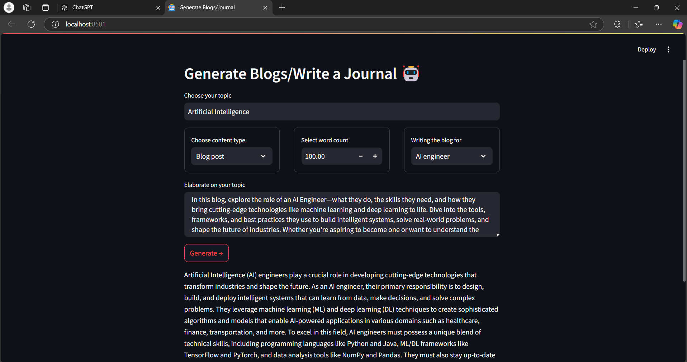

# JournAI ✍️🤖  
**JournAI** is an AI-powered blog and personal journal generator designed to simplify writing tasks with creativity and precision. Whether you're a professional, researcher, or simply someone looking to pen down personal thoughts, JournAI delivers tailored content in no time.  

## 🛠️ Features  
- **Topic Selection**: Write about anything that interests you, from cutting-edge AI to personal reflections.  
- **Content Types**: Choose between blog posts and personal journal entries.  
- **Audience-Specific Writing**: Generate content tailored for specific audiences (e.g., AI engineers, researchers, or general readers).  
- **Customizable Word Count**: Control the length of the content with a simple word count slider.  
- **Interactive Interface**: A user-friendly interface built using Streamlit.  

<!--  -->

## 🚧 Under Development  
JournAI is currently in its early stages. Future updates will include:  
- Advanced AI models for more nuanced and creative content generation.  
- Support for multiple languages.  
- Enhanced personalization features.  

Stay tuned for exciting new features!  

## 🏗️ Tech Stack  
- **Programming Language**: Python  
- **Framework**: Streamlit for the web application  
- **Language Model**: LLaMA (via `ctransformers` for model inference)  
- **Libraries**:  
  - `ctransformers`  
  - `langchain`  
  - Core Python libraries  

## 🚀 Getting Started  

### Prerequisites  
1. Python 3.8+  
2. Install dependencies:  
   ```bash  
   pip install -r requirements.txt  
   ```  

### Run the Application  
1. Clone this repository.  
2. Navigate to the project directory.  
3. Run the Streamlit app:  
   ```bash  
   streamlit run app.py  
   ```  

4. Open the app in your browser at `localhost:8501`.  

## 🖼️ Current Output Preview  


## 📂 Project Structure  
- **models/**: Pretrained models (e.g., LLaMA).  
- **outputs/**: Contains generated content previews.  
- **app.py**: The main application script.  

## 🤝 Contributing  
We welcome contributions! Feel free to fork the repository, submit pull requests, or suggest ideas in the issues section.  

## 📜 License  
This project is licensed under the [MIT License](LICENSE).  

## 🙌 Acknowledgments  
- Inspired by advancements in AI writing tools.  
- Thanks to the open-source community for providing powerful frameworks and tools.
