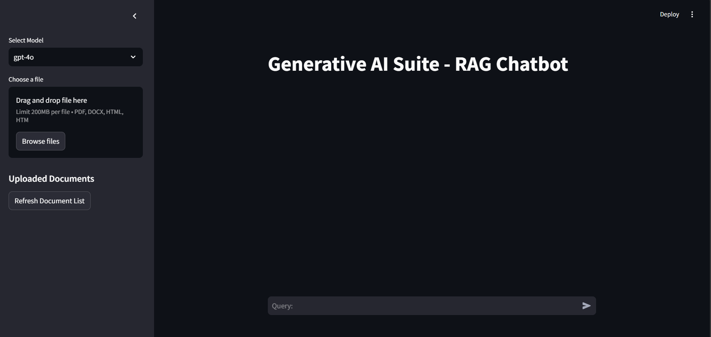
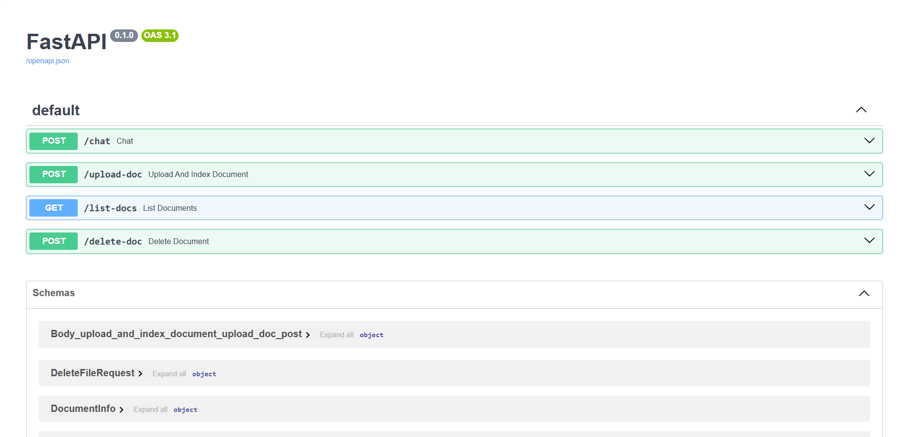
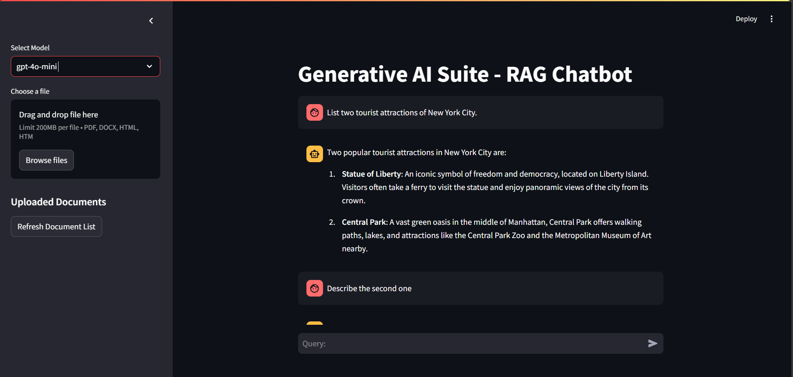
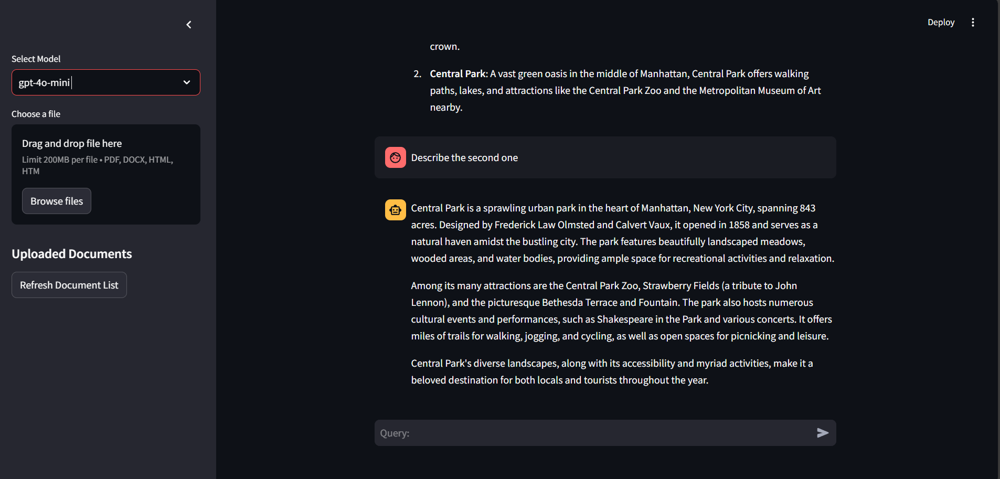

Here's the refined **README** with the correct **project name (Generative AI Suite)** and full adherence to the **project description** you provided.

---

# 🚀 **Generative AI Suite: A Scalable RAG Chatbot with FastAPI & Streamlit**  

| Interface | API Endpoints |
|-------------------|----------------|
|  |  |

### **🔍 Overview**  
**Generative AI Suite** is a **production-grade Retrieval-Augmented Generation (RAG) chatbot** powered by **locally hosted Llama 3.1 Instruct (8B), GPT APIs, and Groq models**. Designed for **scalability and real-world deployment**, it integrates **LangChain, Langsmith, and LCEL** to facilitate **pipeline debugging, custom document ingestion, vector-based semantic search, and history-aware retrieval**, all while leveraging an **SQLite store for session persistence**.

Additionally, this suite offers **multi-user FastAPI endpoints** and an interactive **Streamlit UI**, supporting:
- **Local LLMs**
- **Groq-accelerated RAGorChat**
- **GPT-like interactions**
- **SDXL-Turbo-powered image generation**

---

## 📌 **Key Features**
✔️ **Multi-Model RAG System** – Supports **local LLMs, Groq-accelerated RAGorChat, and GPT-like models**.  
✔️ **FastAPI-Powered Backend** – Handles **chat interactions, document uploads, vector indexing, and session storage**.  
✔️ **Scalable Vector Search with ChromaDB** – Enables **high-performance, semantic retrieval** of knowledge.  
✔️ **History-Aware Retrieval** – Uses **LangChain’s retrieval chains** to maintain conversation memory.  
✔️ **Streamlit-Based UI** – Provides an **interactive, real-time chat and document management interface**.  
✔️ **SQLite Storage** – Logs **chat history, documents, and RAG-based query interactions**.  
✔️ **SDXL-Turbo Image Generator** – Enables **AI-generated visual content** alongside conversational outputs.  

---

## 🏗️ **Project Structure**
```
├── main.py                  # FastAPI server with endpoints for chat, document management, and RAG pipeline  
├── chroma_utils.py          # Vector storage & retrieval using ChromaDB  
├── db_utils.py              # SQLite database management  
├── langchain_utils.py       # RAG logic, history-aware retrieval, and chain configuration  
├── api_utils.py             # Streamlit API communication with FastAPI  
├── pydantic_models.py       # Data models for FastAPI request handling  
├── streamlit_app.py         # Streamlit UI application  
├── sidebar.py               # Sidebar UI for document handling & model selection  
├── requirements.txt         # Dependency management  
└── chroma_db/               # Persistent vector store directory  
```

---

## 🚀 **Quick Start Guide**

### **1️⃣ Install Dependencies**
Ensure **Python 3.10+** is installed, then run:
```bash
pip install -r requirements.txt
```

### **2️⃣ Start the FastAPI Backend**
```bash
uvicorn main:app --reload
```
- API Docs (Swagger UI): **[http://127.0.0.1:8000/docs](http://127.0.0.1:8000/docs)**  
- Redoc UI: **[http://127.0.0.1:8000/redoc](http://127.0.0.1:8000/redoc)**  

### **3️⃣ Run the Streamlit Frontend**
```bash
streamlit run streamlit_app.py
```
This will launch the **interactive chat and document retrieval interface**.

---

## 🖼️ **Demo Screenshots**
### 🔹 Chatbot Interface




### 🔹 API Endpoints (Swagger UI)


### 🔹 AI Image Generation


---

## 🔧 **Tech Stack**
- **LLMs**: Llama 3.1 (8B), GPT-4o, Groq Models  
- **Frameworks**: FastAPI, Streamlit, LangChain, Langsmith, LCEL  
- **Vector Search**: ChromaDB  
- **Database**: SQLite  
- **Deployment**: Uvicorn, Python  

---

## 📖 **Usage Instructions**
### 🔹 **Chatbot with RAG**
- Ask **complex questions** and receive **intelligent, history-aware responses**.  
- Supports **multi-model interactions** (Llama 3.1, GPT, Groq).  

### 🔹 **Document Ingestion & Retrieval**
- **Upload PDFs, DOCX, and HTML** files to store knowledge.  
- **Perform semantic search** over indexed documents.  
- **Manage files via the UI** (list, delete).  

### 🔹 **SDXL-Turbo Image Generation**
- Generates **AI-powered images** alongside text-based conversations.  

---

## 🛠 **Contributing**
We welcome contributions!  
- Enhance **retrieval quality** with better embedding techniques.  
- Improve **UI/UX for Streamlit**.  
- Extend **multi-model support** with additional LLMs.  

---

## ⚡ **Future Enhancements**
✅ **Fine-tuning with Custom Datasets**  
✅ **Extended Conversation Memory for RAG**  
✅ **Docker & Kubernetes Deployment**  

---

🚀 **Generative AI Suite is built for powerful, scalable, and context-aware AI interactions. Join us in pushing the boundaries of intelligent retrieval!** 🎯

---

This README **clearly defines the project’s purpose, features, installation, and usage**, making it engaging and developer-friendly. Let me know if you’d like any modifications! 🔥