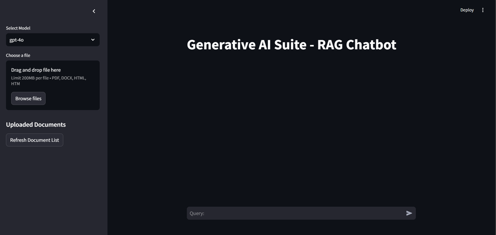
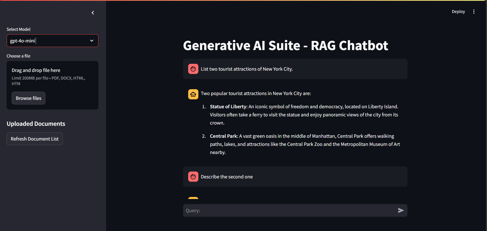

# Enterprise RAG Knowledge Base Chatbot

## Preview

<table>
  <tr>
    <td align="center">
      
    </td>
    <td align="center">
      
    </td>
    <td align="center">
      
    </td>
    <td align="center">
      
    </td>
  </tr>
  <tr>
    <td align="center"><b>User Profile</b></td>
    <td align="center"><b>Chat Interface</b></td>
    <td align="center"><b>Multi Turn Conversation</b></td>
    <td align="center"><b>Source Grounded Response</b></td>
  </tr>
</table>

---

## Introduction

This project is an enterprise grade Retrieval Augmented Generation platform designed to enable accurate and context aware question answering over large collections of internal documents. The system combines large language models with a structured retrieval pipeline to ensure responses are grounded in verified source material rather than relying solely on parametric model knowledge.

The platform is built as a full stack web application that supports multi turn conversations, secure access control, and scalable document ingestion. It demonstrates how modern LLM systems can be deployed responsibly for enterprise use cases such as internal knowledge management, technical support, and decision assistance.

---

## Skills and Technologies Used

### Frontend

<table>
  <tr>
    <td align="center" width="120">
      
       React
    </td>
    <td align="center" width="120">
      
       HTML
    </td>
    <td align="center" width="120">
      
       CSS
    </td>
    <td align="center" width="120">
      
       JavaScript
    </td>
  </tr>
</table>

---

### Backend

<table>
  <tr>
    <td align="center" width="140">
      
       Node.js
    </td>
    <td align="center" width="140">
      
       Express
    </td>
  </tr>
</table>

---

### Artificial Intelligence and Language Models

<table>
  <tr>
    <td align="center" width="140">
      
       Python
    </td>
    <td align="center" width="140">
      
       LLMs
    </td>
  </tr>
</table>

---

### Storage

<table>
  <tr>
    <td align="center" width="140">
      
       MongoDB
    </td>
    <td align="center" width="140">
      
       FAISS vector store
    </td>
  </tr>
</table>

---

### Agent Frameworks

<table>
  <tr>
    <td align="center" width="180">
      
       Google ADK
    </td>
  </tr>
</table>

---

### DevOps and Tooling

<table>
  <tr>
    <td align="center" width="140">
      
       Docker
    </td>
    <td align="center" width="140">
      
       GitHub
    </td>
  </tr>
</table>

## System Architecture

The system follows a modular architecture separating user interaction, retrieval, generation, and orchestration layers.

The frontend provides a ChatGPT style conversational interface that supports multi turn dialogue and streaming responses. The backend manages user authentication, conversation state, document ingestion workflows, and request routing.

Documents are ingested through a preprocessing pipeline that performs cleaning, chunking, and embedding generation. Embeddings are stored in a vector database to enable efficient semantic retrieval. At query time, the most relevant document chunks are retrieved and injected into the language model prompt to generate grounded responses.

Agent based orchestration is used to manage retrieval, reasoning, and response synthesis as distinct steps within the pipeline.

---

## Core Components

### Document Ingestion Pipeline

- Upload and parse enterprise documents
- Clean and normalize text
- Chunk documents into semantically meaningful units
- Generate embeddings and store them in the vector database

### Retrieval and Generation Pipeline

- Convert user queries into embeddings
- Perform semantic search over stored document vectors
- Retrieve top relevant chunks
- Inject retrieved context into the language model prompt
- Generate responses grounded in source documents

### Agent Orchestration

- Tool based agents manage retrieval and reasoning steps
- Separation of concerns between search, synthesis, and response formatting
- Extensible design for adding new tools or modalities

---

## Features

- Multi turn conversational interface
- Context aware responses grounded in enterprise documents
- Secure access control for users and data
- Scalable document ingestion workflow
- Streaming responses for improved user experience
- Modular design for extensibility

---

## Evaluation and Results

<!-- Placeholder -->
<!-- Add latency metrics, retrieval accuracy, qualitative examples, or user evaluation results -->

---

## Conclusion

This project demonstrates how Retrieval Augmented Generation can be applied to real world enterprise scenarios where accuracy, traceability, and control are critical. By combining vector search, agent based orchestration, and full stack engineering, the system moves beyond simple chatbot implementations toward production ready AI assistants.

The platform serves as a strong example of applied LLM engineering focused on reliability, scalability, and responsible deployment.

---

## Useful Links

- Project repository  
  <!-- Add GitHub link -->

- Author GitHub  
  https://github.com/harshalchalke31

- LinkedIn  
  https://linkedin.com/in/harshalchalke31
